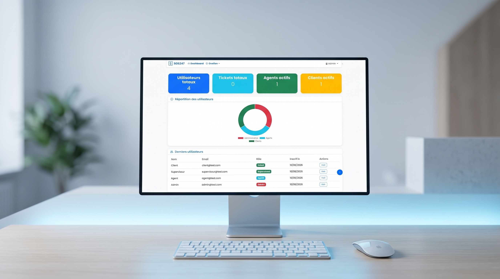

# Helpdesk SOS247

A multi-role IT helpdesk / ticketing system built with Laravel. Clients submit support tickets, agents work them, supervisors monitor team activity, and admins manage the whole system — with real-time notifications and role-specific dashboards.


## Key Features

- **Multi-role access** — Admin, Supervisor, Agent, and Client roles (via `spatie/laravel-permission`)
- **Ticket lifecycle** — creation, status/priority/category tracking, attachments, and comments
- **Real-time notifications** — powered by Laravel Reverb (WebSockets) + Laravel Echo/Pusher client
- **Role-specific dashboards** — stats and charts (Chart.js) tailored to each role
- **PDF export** — ticket/report generation via `barryvdh/laravel-dompdf`
- **Excel import/export** — via `maatwebsite/excel`
- **Search & filtering** — advanced ticket search across status/priority/category
- **Responsive UI** — Bootstrap 5 + Alpine.js

## Project Structure

```
helpdesk_sos247/
├── app/
│   ├── Http/
│   │   └── Controllers/
│   │       ├── Admin/          # System administration
│   │       ├── Supervisor/     # Team oversight
│   │       ├── Agent/          # Ticket handling
│   │       ├── User/           # Client-facing ticket flows
│   │       └── Auth/
│   ├── Models/
│   ├── Events/                 # Broadcast events (Reverb)
│   ├── Notifications/
│   └── Console/Commands/
├── routes/
│   ├── web.php
│   ├── auth.php
│   └── console.php
├── resources/                  # Blade views, JS, CSS
├── database/                   # Migrations, seeders, factories
├── config/
├── tests/
└── .env.example
```

## Getting Started

### Prerequisites

- PHP 8.2+, Composer
- Node.js 18+ and npm
- MySQL/MariaDB (or SQLite for local dev)

### Environment Variables

```bash
cp .env.example .env
php artisan key:generate
```

Then set your database connection (`DB_CONNECTION`, `DB_DATABASE`, ...) and, if using real-time notifications, the `REVERB_*` broadcasting credentials in `.env`.

### Installation

```bash
composer install
npm install
```

### Database

```bash
php artisan migrate --seed
```

### Local Development

Run each in its own terminal:

```bash
php artisan serve            # backend at http://localhost:8000
npm run dev                  # Vite dev server (assets)
php artisan queue:listen     # background jobs
php artisan reverb:start     # if using real-time notifications
```

### Build (production assets)

```bash
npm run build
```

## Testing

```bash
php artisan test
```

Uses PHPUnit with Faker-generated fixtures (`fakerphp/faker`) and Mockery for mocking.
